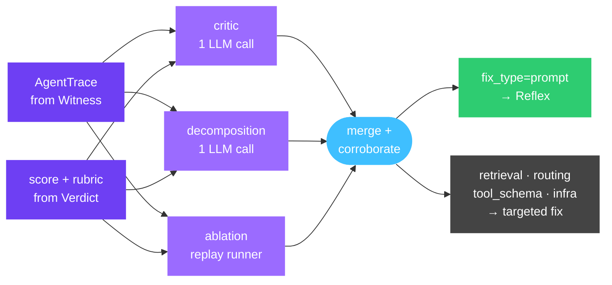

# aevyra-origin

[](https://github.com/aevyraai/origin/actions/workflows/ci.yml)
[](https://github.com/aevyraai/origin/actions/workflows/security.yml)
[](LICENSE)
[](https://aevyra.mintlify.app/origin/)

When an agent fails, the cause is rarely obvious. Origin takes the trace of
what ran, the score of how it did, and a rubric of what good looks like — and
tells you which span failed, why, and what kind of fix it needs.

```
Witness  →  captures what happened         (aevyra-witness)
Verdict  →  judges it                      (aevyra-verdict)
Origin   →  finds where it went wrong      (you are here)
           └─ fix_type="prompt"? → Reflex  (aevyra-reflex)
           └─ fix_type="retrieval"?  → fix the index
           └─ fix_type="tool_schema"? → fix the schema
           └─ fix_type="routing"?    → fix the router
           └─ fix_type="infrastructure"? → fix ops
```



## Use cases

- **Debugging a failing agent** — know whether the planner, a retrieval step,
  or a tool call caused the bad output, without adding print statements or
  re-running manually.
- **Prioritising fixes** — not all failures are prompt failures. Origin tells
  you whether to rewrite a prompt, fix a retrieval index, or correct a tool
  schema before you spend time on the wrong thing.
- **Routing to Reflex** — when `fix_type="prompt"`, hand the attribution
  directly to Reflex for automated prompt repair. Origin's `by_prompt()` gives
  Reflex exactly the prompt-level view it needs.

Works with any LLM — Claude, OpenAI, OpenRouter, local Ollama or vLLM, or any
OpenAI-compatible endpoint.

## Install

```bash
pip install aevyra-origin               # Claude included by default
pip install aevyra-origin[openai]       # add OpenAI, OpenRouter, Together, Groq, Ollama
pip install aevyra-origin[all]          # everything
```

Python 3.10+.

| Provider | Extra | Env var |
|---|---|---|
| **Anthropic** | _(included)_ | `ANTHROPIC_API_KEY` |
| **OpenAI** | `[openai]` | `OPENAI_API_KEY` |
| **OpenRouter** | `[openai]` | `OPENROUTER_API_KEY` |
| **Together AI** | `[openai]` | `TOGETHER_API_KEY` |
| **Groq** | `[openai]` | `GROQ_API_KEY` |
| **Ollama** | `[openai]` | — |

## Quick start

Instrument your pipeline with `@span`, hand Origin a rubric and a judge, get
back an attribution:

```python
from aevyra_witness.runtime import span
from aevyra_origin import diagnose_pipeline
from aevyra_origin.llm import anthropic_llm
from aevyra_origin.judges import judge_from_verdict
from aevyra_verdict import LLMJudge
from aevyra_verdict.providers import get_provider

@span("classify")
def classify(text): ...

@span("retrieve")
def retrieve(topic): ...

@span("answer", optimize=True, prompt_id="answer_v1")
def answer(q, docs): ...

def my_agent(q):
    topic = classify(q)
    return answer(q, retrieve(topic))

judge = judge_from_verdict(LLMJudge(judge_provider=get_provider("anthropic")))

result = diagnose_pipeline(
    my_agent, "I was charged twice — how do I get a refund?",
    judge=judge,
    rubric="Accurate, grounded in the policy docs, and addresses the user's concern.",
    llm=anthropic_llm(),
)

print(result.render())
```

`diagnose_pipeline` runs your pipeline under a tracer, scores the captured
trace, and invokes the attribution engine — all in one call. `result.render()`
prints something like:

```
Origin attribution  (method=all, score=0.31)
  Summary: The retrieve span failed to surface the refund policy document,
  leaving the answer span without the grounding it needed. The classify
  span contributed by routing to the wrong topic, narrowing the retrieval
  scope before it even ran.

  1. retrieve (id=n2)  [primary, confidence=0.89, fix=retrieval]
     Returned generic FAQ results; the refund policy doc was not in the
     retrieved set despite being present in the index.

  2. classify (id=n1)  [contributing, confidence=0.44, fix=routing]
     Classified as "billing/general" rather than "billing/refund",
     causing the retriever to miss the policy-specific corpus.

  3. answer (id=n3)  [minor, confidence=0.18, fix=prompt]
     Given the missing context, the answer defaulted to a generic
     apology rather than citing the 30-day refund window.

  --- Prompt-level rollup (for Reflex) ---
  prompt=answer_v1  [minor, confidence=0.18, spans=1]
```

The `fix_type` tells you where to direct the repair effort. Only spans with
`fix_type="prompt"` are candidates for Reflex; the others need a different
intervention.

Don't have a Verdict metric? Pass any `Callable[[AgentTrace], float]` as
`judge=` — including a lambda that wraps your own evaluator.

## Three on-ramps

The turnkey path is the recommended starting point, but Origin's attribution
engine works with any trace you can produce:

1. **Turnkey** — give Origin your pipeline and it handles tracing + scoring:
   `diagnose_pipeline(pipeline, input, judge, rubric, llm)`. Your pipeline
   just needs `@span` decorators from `aevyra_witness.runtime`.

2. **Adapter** — if you already emit framework logs (OpenClaw JSONL today;
   LangSmith, OTel, and others are additive), parse them into an `AgentTrace`
   and hand it to Origin:

    ```python
    from aevyra_witness.adapters import from_openclaw_jsonl
    trace = from_openclaw_jsonl(log_lines)
    origin.diagnose(trace=trace, score=0.4, rubric=...)
    ```

3. **Raw** — you already have an `AgentTrace` and a score:

    ```python
    from aevyra_origin import Origin
    origin = Origin(llm=anthropic_llm())
    result = origin.diagnose(trace=my_trace, score=0.4, rubric=...)
    ```

## What Origin diagnoses

Not all agent failures are prompt failures. Origin classifies each culprit span
into one of six fix types:

| `fix_type` | What it means | Who fixes it |
|---|---|---|
| `prompt` | The instructions or context in the prompt need changing | Reflex |
| `tool_schema` | The tool's input schema is ambiguous; the LLM called it wrong | Schema redesign |
| `retrieval` | The retrieval step fetched wrong, irrelevant, or missing docs | Index / embedding fix |
| `routing` | The pipeline sent the query down the wrong branch or tool | Routing logic fix |
| `infrastructure` | A transient or systemic issue: timeout, rate limit, auth error | Ops / infra fix |
| `unknown` | Origin could not determine the fix type | Manual review |

This matters because Reflex can only help with `fix_type="prompt"`. When Origin
tells you the problem is in the retrieval index or the tool schema, you know
immediately where to look — and that rewriting the prompt won't help.

## Methods

Origin ships three attribution methods that can be run individually or combined.

**LLM-as-critic** (`method="critic"`) makes one LLM call. The LLM reads the
rubric, score, and full trace, and returns a ranked list of culprit spans with
severity, confidence, reasoning, and fix_type. Fast and general — works for any
rubric. Best for single-cause failures.

**Score decomposition** (`method="decomposition"`) also makes one LLM call, but
approaches it differently. The LLM enumerates the rubric's underlying criteria,
attributes each criterion to the span(s) responsible, and aggregates per-span
blame across failed criteria. Better at surfacing distributed failures where
multiple steps each contributed.

**Ablation** (`method="ablation"`) is the causal method. For each candidate
span, it replaces the span's output with a neutral placeholder, re-runs the
pipeline via a user-supplied `runner`, and re-scores via the `judge`. It's the
only method that makes a causal claim — a large score delta means the span is
genuinely responsible. Requires a deterministic runner.

**`method="all"`** runs all available methods and merges the results. The two
LLM methods always run (two LLM calls total). Ablation participates when a
`runner` is supplied; otherwise it's silently skipped. Spans flagged by multiple
methods receive a corroboration bonus. `fix_type` is resolved to the most
specific type across methods (`"retrieval"` wins over `"unknown"`).

### Ablation quick start

```python
from aevyra_origin import diagnose_pipeline
from aevyra_witness import AgentTrace

def my_runner(trace: AgentTrace, overrides: dict) -> AgentTrace:
    # Replay the pipeline with overrides[span_id] forced as the output.
    # LLM calls should be cached or mocked for determinism.
    ...

result = diagnose_pipeline(
    my_agent, "how do I refund?",
    judge=judge, rubric=rubric, llm=anthropic_llm(),
    runner=my_runner,
    method="all",
)
```

Ablation cost control: `ablation_budget=N` caps total runs. The raw on-ramp
exposes `candidates=["span_a", "span_b"]` to limit the sweep to specific span ids.

## API

### `diagnose_pipeline(...)` → `Attribution`

```python
result = diagnose_pipeline(
    pipeline, *args,                  # your callable + whatever it takes
    judge=...,                        # Callable[[AgentTrace], float]
    rubric=...,                       # str
    llm=...,                          # Callable[[str], str]
    ideal=None,                       # optional reference output
    trace_metadata=None,              # dict, stored on the trace
    method="all",                     # "critic" | "decomposition" | "ablation" | "all"
    runner=None,                      # ablation replay function (enables ablation)
    ablation_placeholder="null",      # "null" or "ideal"
    ablation_budget=None,             # cap ablation runs
    **kwargs,                         # forwarded to your pipeline
)
```

### `Origin.diagnose(...)` → `Attribution`

```python
result = origin.diagnose(
    trace=...,                        # AgentTrace
    score=...,                        # float, the judge score being explained
    rubric=...,                       # str
    method="all",                     # "critic" | "decomposition" | "ablation" | "all"
    ablation_placeholder="null",
    ablation_budget=None,
)
```

### `Attribution`

```python
result.summary              # str — one-paragraph overview
result.culprits             # list[NodeAttribution], sorted by confidence desc
result.method               # "critic" | "decomposition" | "ablation" | "all"
result.score                # float — the judge score
result.raw                  # dict — pipeline_output, captured_trace, method-level raw outputs

result.top_culprit()        # NodeAttribution | None
result.primary_culprits()   # [NodeAttribution] — severity="primary"
result.by_prompt()          # [PromptAttribution] — roll blame up to prompt_id for Reflex
result.render()             # str — multi-line CLI rendering
result.to_json(indent=2)    # str — JSON serialization
```

### `NodeAttribution`

```python
c.node_name                 # str — matches a name in the trace
c.severity                  # "primary" | "contributing" | "minor"
c.confidence                # float in [0, 1]
c.reasoning                 # str — grounded in the trace
c.node_id                   # str | None — span id (required for DAG traces with repeated names)
c.prompt_id                 # str | None — prompt identity; used by by_prompt() rollup
c.fix_type                  # "prompt" | "tool_schema" | "retrieval" | "routing"
                            #           | "infrastructure" | "unknown"
```

### `Attribution.by_prompt()` → `list[PromptAttribution]`

For DAG traces where the same prompt fires at many call sites, `by_prompt()`
rolls span-level blame up to the prompt level — mean confidence across spans
sharing a `prompt_id`, max severity, concatenated reasoning. Only culprits with
`fix_type="prompt"` are meaningful inputs to Reflex.

```python
for pa in result.by_prompt():
    print(pa.prompt_id, pa.severity, pa.confidence)
```

### `judge_from_verdict(metric, *, ...)` → `Judge`

Adapts any Verdict `Metric` (`LLMJudge`, `ExactMatch`, `BleuScore`,
`RougeScore`, custom metrics) to Origin's `Callable[[AgentTrace], float]`
contract. Duck-typed — no hard Verdict dependency.

```python
from aevyra_origin.judges import judge_from_verdict
from aevyra_verdict import LLMJudge

judge = judge_from_verdict(LLMJudge(judge_provider=provider))
```

Customize what gets fed to the metric with `extract_response=...` and
`extract_messages=...` when the defaults aren't right for your pipeline.

## CLI

For pre-captured traces (the raw on-ramp):

```bash
aevyra-origin diagnose trace.json \
  --score 0.4 \
  --rubric rubric.txt \
  --model anthropic/claude-sonnet-4-5 \
  --method all \
  --output result.json     # optional — writes full Attribution JSON
```

`--rubric -` reads from stdin. `--model` follows the same `provider/model`
convention as aevyra-reflex — `openrouter/qwen/qwen3-8b`, `openai/gpt-4o`,
`ollama/qwen3:8b`. The render (including prompt-level rollup for Reflex) always
goes to stdout.

## Interop with Reflex

`by_prompt()` on the result gives Reflex the prompt-level view it needs. Only
culprits with `fix_type="prompt"` are handed to Reflex — the others (retrieval,
routing, infrastructure, tool_schema) need a different repair.

```python
# What Reflex consumes:
for pa in result.by_prompt():
    print(pa.prompt_id, pa.severity, pa.confidence)

# Wire Origin's LLM to Reflex's LLM type:
from aevyra_reflex import LLM
from aevyra_origin.llm import LLMFn

reflex_llm = LLM(model="claude-sonnet-4-5")
llm: LLMFn = lambda p: reflex_llm.generate(p, temperature=0.0)
```

## License

Apache-2.0.
