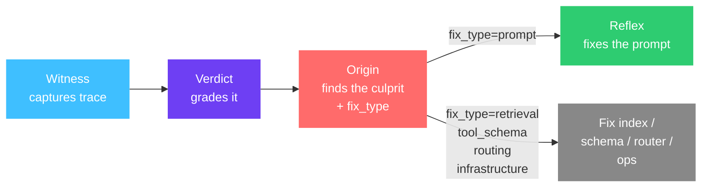

aevyra-origin diagnoses why your agent failed. Point it at your pipeline and a
rubric; it runs the pipeline, grades it with a judge, and returns a ranked list
of culprit spans — each with severity, confidence, grounded reasoning, and a
`fix_type` that tells you exactly where the repair effort belongs.

```bash
pip install aevyra-origin
```

Not all agent failures are prompt failures. Origin classifies each culprit into
one of six fix types so you know what to actually change:

```
retrieve  [primary, confidence=0.89, fix=retrieval]
  → The refund policy doc wasn't in the retrieved set.
  → Fix the index, not the prompt.

classify  [contributing, confidence=0.44, fix=routing]
  → Sent the query to the wrong topic corpus.
  → Fix the routing classifier.

answer    [minor, confidence=0.18, fix=prompt]
  → Defaulted to a generic apology given missing context.
  → Reflex can fix this.
```

Only `fix_type="prompt"` spans are candidates for Reflex — the others (retrieval,
routing, tool_schema, infrastructure) need a different intervention. Origin tells
you which is which so you don't waste time rewriting prompts that won't help.

## Where Origin fits

Origin is the diagnosis stage in the Aevyra stack:



Witness captures the execution trace. Verdict scores it. Origin reads both,
pinpoints the failure, and classifies the fix type. When the fix is in a prompt,
Reflex can act on it automatically. For every other failure type — a bad retrieval
index, an ambiguous tool schema, a mis-routing — Origin tells you exactly where
to look so you don't waste time rewriting prompts that won't help.

## What it diagnoses

| `fix_type` | What it means | Who fixes it |
|---|---|---|
| `prompt` | The instructions or context in the prompt need changing | Reflex |
| `tool_schema` | The tool's input schema is ambiguous; the LLM called it wrong | Schema redesign |
| `retrieval` | The retrieval step fetched wrong, irrelevant, or missing docs | Index / embedding fix |
| `routing` | The pipeline sent the query down the wrong branch or tool | Routing logic fix |
| `infrastructure` | Timeout, rate limit, auth error, quota exceeded | Ops / infra fix |
| `unknown` | Origin could not determine the fix type | Manual review |

## Three attribution methods

Origin ships three methods that can run independently or together:

**LLM-as-critic** (`method="critic"`) reads the rubric, score, and full trace in
one LLM call and returns a ranked list of culprit spans. Fast, general, works for
any rubric.

**Score decomposition** (`method="decomposition"`) breaks the rubric into its
underlying criteria, attributes each criterion to a span, and aggregates blame
across failed criteria. Better at surfacing distributed failures where multiple
spans each contributed.

**Ablation** (`method="ablation"`) replaces each span's output with a neutral
placeholder, replays the pipeline via a user-supplied runner, and re-scores. The
only method that makes a causal claim — a large score drop means the span is
genuinely responsible.

`method="all"` (default) runs critic and decomposition always (two LLM calls),
adds ablation when you supply a runner, and merges the results with a
corroboration bonus for spans named by multiple methods.

<CardGroup cols={2}>
  <Card title="Quick start" icon="bolt" href="/origin/quickstart">
    Diagnose your first pipeline failure in under 5 minutes
  </Card>
  <Card title="Tutorial" icon="book-open" href="/origin/tutorial-support-triage">
    Full walkthrough: a plan-act-respond agent that gets the wrong answer
  </Card>
  <Card title="Methods" icon="flask" href="/origin/methods">
    Critic, decomposition, ablation — when to use each
  </Card>
  <Card title="API reference" icon="code" href="/origin/api/attribution">
    Attribution, NodeAttribution, PromptAttribution
  </Card>
</CardGroup>

## Works with any LLM

Claude, OpenAI, OpenRouter, Ollama, vLLM, or any OpenAI-compatible endpoint:

```bash
pip install aevyra-origin              # Claude included by default
pip install aevyra-origin[openai]      # add OpenAI, OpenRouter, Together, Groq, Ollama
```

```python
from aevyra_origin.llm import anthropic_llm, openai_llm

llm = anthropic_llm(model="claude-sonnet-4-5")
# or
llm = openai_llm(model="gpt-4o")
# or local
llm = openai_llm(model="llama3.1:8b", base_url="http://localhost:11434/v1", api_key="ollama")
```

Python 3.10+. Apache-2.0 licensed.
