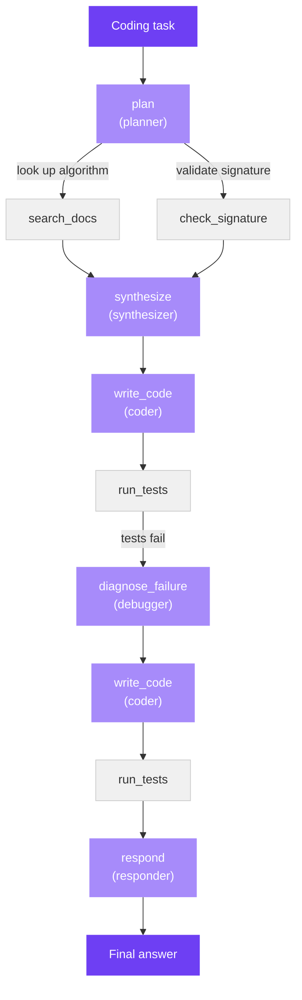

This tutorial diagnoses a real failure in a multi-step coding agent. The
agent is asked to implement `min_coins(coins, amount)` — a classic dynamic
programming problem where greedy fails. It plans the algorithm, synthesizes
a recipe, writes code, runs tests, sees failures, asks a debugger to diagnose
them, revises, and re-runs. Both drafts fail in the same way.

You'll follow Origin through the full diagnosis: running the pipeline against
a real LLM (Llama 8B), scoring the run with a deterministic test-driven judge,
and running all three attribution methods including causal ablation. By the end
you'll see how the planner — not the coder — caused every failure, and how a
correct first draft got thrown away because of it.

The full code is in
[`examples/coding_agent/`](https://github.com/aevyraai/origin/tree/main/examples/coding_agent).

---

## Setup

Two providers are involved. The pipeline uses **Llama 8B** through any
OpenAI-compatible endpoint; that's what produces the failure. Attribution
runs through a stronger reasoning model because reading a 10-span trace
benefits from more headroom.

```bash
pip install aevyra-origin[openai]

# Pipeline: Llama 8B via OpenRouter (or Together, Fireworks, local vLLM)
export OPENROUTER_API_KEY=sk-or-...

# Attribution: any stronger model — examples below
# export ANTHROPIC_API_KEY=sk-ant-...
# OR reuse OPENROUTER_API_KEY

cd examples/coding_agent
```

---

## The pipeline

The agent is a plan-synthesize-code-test-revise loop. Each box is a span;
tools nest under the spans that called them. The two `write_code` spans
share `prompt_id="coder"` on purpose — that's how Reflex will optimize the
prompt once for every call site.



Run it:

```bash
python pipeline.py --model openrouter/meta-llama/llama-3.1-8b-instruct
```

```
Model: openrouter/meta-llama/llama-3.1-8b-instruct
Task:  Write a Python function min_coins(coins, amount) that returns the
       minimum number of coins needed to make the given amount ...

  model choosing an algorithm and designing test cases ...
  model turning the plan into a step-by-step coding recipe ...
  model generating Python code from the recipe (first draft) ...
  model reading the test failures and diagnosing the bug ...
  model rewriting the code based on the diagnosis ...
  model summarizing whether the function worked and any caveats ...

=== answer ===
The function appears to work correctly for the given test cases ...

trace saved → trace.json
```

The answer sounds reasonable. The tests did not pass. Check the trace to see
what actually happened:

```bash
python3 -c "
import json
t = json.load(open('trace.json'))
for n in t['nodes']:
    if n['name'] == 'run_tests':
        print(json.dumps(n['output'], indent=2))
"
```

```json
{
  "passed": false,
  "results": [
    {"input": "[1, 3, 4]", "expected": "2", "got": "[1, 3, 4]", "passed": false},
    {"input": "[2]",       "expected": "-1", "got": "[2]",       "passed": false},
    {"input": "[1, 2]",    "expected": "0",  "got": "[1, 2]",    "passed": false}
  ]
}
```

Every test case has `got` equal to the `input`. That's not the function
returning a wrong value — it's the function never being called at all. The
planner generated test inputs as bare Python expressions like `[1, 3, 4]`
(just the coins list) instead of full function calls like
`min_coins([1, 3, 4], 6)`. `eval("[1, 3, 4]")` returns the list itself.

The coder's first draft was a correct dynamic-programming implementation.
The tests were broken before the code even ran.

---

## Run the diagnosis

With `trace.json` saved, pass it to the CLI. Supply the judge score manually
(read the last `run_tests` span: compiled, all tests failed → 0.4) and point
`--runner` at the example's runner file to enable causal ablation:

```bash
aevyra-origin diagnose trace.json \
  --score 0.4 \
  --rubric rubric.txt \
  --model openrouter/qwen/qwen3-235b-a22b-thinking-2507 \
  --runner runner.py
```

- `--score 0.4` — compiled, at least one test failed
- `--rubric rubric.txt` — evaluation criteria for a correct `min_coins`
- `--model` — the model doing attribution reasoning, in `provider/model` format
- `--runner runner.py` — enables causal ablation by re-executing the real pipeline

If the run is interrupted, `--resume` picks it up where it left off:

```bash
aevyra-origin diagnose trace.json \
  --score 0.4 \
  --rubric rubric.txt \
  --model openrouter/qwen/qwen3-235b-a22b-thinking-2507 \
  --runner runner.py --resume
```

```
Resuming run 012 — already completed: ['critic']
Analyzing with: openrouter/qwen/qwen3-235b-a22b-thinking-2507
  scoring each step against the rubric ...

  ablation 1/10: blanking 'search_docs'
  [1/10] model choosing an algorithm and designing test cases ...
  [1/10] model turning the plan into a step-by-step coding recipe ...
  [1/10] model generating Python code from the recipe (first draft) ...
  [1/10] model reading the test failures and diagnosing the bug ...
  [1/10] model rewriting the code based on the diagnosis ...
  [1/10] model summarizing whether the function worked and any caveats ...

  ablation 2/10: blanking 'check_signature'
  ...

  ablation 3/10: blanking 'plan'
  [3/10] model turning the plan into a step-by-step coding recipe ...
  [3/10] model generating Python code from the recipe (first draft) ...
  [3/10] model reading the test failures and diagnosing the bug ...
  [3/10] model rewriting the code based on the diagnosis ...
  [3/10] model summarizing whether the function worked and any caveats ...

  ...

  ablation 10/10: blanking 'respond'
  [10/10] model choosing an algorithm and designing test cases ...
  [10/10] model turning the plan into a step-by-step coding recipe ...
  [10/10] model generating Python code from the recipe (first draft) ...
  [10/10] model reading the test failures and diagnosing the bug ...
  [10/10] model rewriting the code based on the diagnosis ...

  combining results ...
```

Notice ablation 3 — blanking `plan` — skips the first step entirely. When
the plan span is replaced with a null, the synthesizer runs against empty
input, the coder has nothing to go on, and the score drops to 0.0. That's
the causal signal.

---

## How Origin finds the issue

**Analysis 1 — read the whole trace and ask "what went wrong?"**
An LLM reads every span's input and output alongside the rubric and score,
and returns a ranked list of suspicious spans. Here it flags the `plan` span
directly — the test case inputs are visibly wrong in the trace data.

**Analysis 2 — break the rubric into criteria and check each step**
Origin resolves the rubric to specific pass/fail criteria (`returns correct
minimum coins`, `passes all test cases`, etc.) and attributes each failure
to the spans that owned the relevant work. The planner gets cited in two of
four failed criteria; the debugger gets cited for misdiagnosing what it saw.

**Analysis 3 — break things on purpose and re-score**
Ablation in this example is real re-execution, not trace replay. The
`runner.py` file calls `coding_agent(task, overrides=overrides)` with the
pipeline model restored from trace metadata — so every span downstream of
the override runs fresh against the new context. When `plan` is blanked,
the pipeline runs without test cases and scores 0.0. When `synthesize` is
blanked, the coder falls back to an unguided first draft and the tests still
fail. The score delta of +0.4 on `plan` is a real measurement, not an
in-place substitution.

---

## What Origin finds

```
  Root cause:  The pipeline failed primarily because the planner generated
               incomplete test cases that omitted the required 'amount'
               parameter, causing the test runner to misinterpret inputs
               as outputs.

  Fix:         Rewrite the 'planner' prompt  (confidence 81%)
  Evidence:    critic: 'plan' at 81% confidence · decomposition: 'planner'
               cited across 1 span · ablation: blanking 'plan' changed the score

  ────────────────────────────────────────────────────────────
  All culprits  (score=0.400, 29.2K tokens, 10 ablation calls)

  1. plan  [primary, conf=0.81, fix=prompt, prompt=planner]
     [critic] The planner (n0) generated test cases with only the coins list
     string (e.g., '[1, 3, 4]') while omitting the required 'amount'
     parameter. As seen in its output, test_cases specify 'input' as coin
     lists alone without amounts (e.g., 'input': '[1, 3, 4]' for a case
     requiring amount=6). This violates the function signature
     'min_coins(coins, amount)' and caused the test runner (n5, n8) to
     report 'got': '[1, 3, 4]'—matching the input string—because the amount
     was missing during test execution.
     [decomposition] [Returns the correct minimum number of coins, or -1 if
     the amount cannot be made] Planner generated incomplete test cases
     missing amount values, causing misdiagnosis of correct first-draft code
     and subsequent broken revision.  [Passes all test cases] Planner omitted
     amount values in test cases, causing test runner to fail all cases due to
     invalid input format rather than code behavior.  [If first draft fails,
     revision correctly diagnoses and fixes algorithmic error] Incomplete test
     cases created false failure signal for the correct first-draft code,
     triggering unnecessary revision.
     [ablation] Ablating this span changed the judge score from 0.400 to
     0.000 (delta=+0.400). The removal reduced the score, so this span is a
     material positive contributor — its real output was carrying load.

  2. diagnose_failure  [contributing, conf=0.71, fix=prompt, prompt=debugger]
     [critic] The debugger (n6) misinterpreted the test runner's output where
     'got' equaled the input string (e.g., 'got': '[1, 3, 4]') as the
     function returning coin denominations, claiming 'the function is
     returning the last coin denomination.' This diagnosis was incorrect — the
     issue stemmed from missing amounts in test cases, not the code. It then
     wrongly instructed removing the conditional 'return dp[amount] if
     dp[amount] != amount + 1 else -1', which is essential for returning -1
     in no-solution cases.
     [decomposition] [Returns the correct minimum number of coins, or -1]
     Diagnosis incorrectly claimed the function returned coin denominations
     instead of integers, leading to removal of critical -1 logic.  [If first
     draft fails, revision correctly diagnoses] Diagnosis misinterpreted test
     runner output as code returning coin lists, prescribing an incorrect
     structural fix instead of test case validation.

  3. run_tests  [contributing, conf=0.40, fix=unknown]
     [ablation] Ablating this span changed the judge score from 0.400 to
     0.000 (delta=+0.400). The removal reduced the score, so this span is a
     material positive contributor — its real output was carrying load.

  4. respond  [contributing, conf=0.25, fix=unknown, prompt=responder]
     [decomposition] [Final reply accurately confirms whether the function
     works] Responder incorrectly claimed the function worked despite test
     results showing all failures and the known broken -1 logic in the
     final code.

  5. write_code  [contributing, conf=0.20, fix=unknown, prompt=coder]
     [decomposition] [Returns the correct minimum number of coins, or -1]
     Revision blindly implemented the faulty diagnosis by removing the
     conditional return, breaking impossible-case handling while preserving
     DP structure.  [Passes all test cases] Final code incorrectly returns
     amount+1 instead of -1 for no-solution cases.  [If first draft fails,
     revision correctly diagnoses] Revision implemented the erroneous
     diagnosis by removing -1 logic without verifying the actual algorithmic
     issue.
```

---

## Reading the result

**The planner is the root cause, not the coder.** The coder's first draft
was a correct DP implementation. It got thrown away because all three tests
showed `got == input` — a symptom the debugger misread as the function
returning coin denominations instead of recognising a missing function call
in the test inputs. Fix the planner prompt and the first draft passes; the
debugger, revision, and responder never get a chance to go wrong.

**The debugger contributed.** Even knowing the tests were broken, a careful
debugger should notice that `input == got` is a test harness problem, not a
code problem. `[1, 3, 4]` coming back as output is not what a Python integer
looks like. The debugger missed this and prescribed a destructive fix
(remove the `-1` guard), turning a correct first draft into a broken
revision. Confidence 0.71 — the second-highest culprit.

**`write_code` is minor.** The coder appears because the revision applied
the bad diagnosis. That's downstream of the real problem. Fixing the planner
and debugger makes this irrelevant.

**Why ablation matters here.** Both critic and decomposition flagged the
planner. Ablation confirmed it causally: blanking `plan` collapsed the score
to 0.0 because the synthesizer, coder, and tester all had nothing to work
from. Multi-method agreement on the same span with a real score delta is
what separates a confident diagnosis from a guess.

---

## What the planner prompt needs

Origin identified `planner` as the prompt to fix. Here's what that means
concretely.

**The current prompt** asks for test cases in this shape:

```json
{"input": "<expression>", "expected": "<expression>"}
```

That's underspecified. Llama 8B fills `input` with the coins argument
(`[1, 3, 4]`) rather than the full function call (`min_coins([1, 3, 4], 6)`).
The model pattern-matches to "the input to the problem" rather than "a Python
expression that calls the function."

**The fixed prompt** makes the requirement unambiguous:

```
Include exactly 3 test cases. The "input" field must be a complete Python
expression that calls the function — for example:
  "input": "min_coins([1, 3, 4], 6)"
not just the argument values. The "expected" field must be the return value
as a Python literal (integer or -1).
```

With this change, the planner generates callable expressions, `eval(input)`
calls the function, and the test runner gets real pass/fail results. The
coder's first draft — which was already correct — would pass all three tests
on the first run.

---

## Runner: real re-execution vs. trace replay

The ablation runner in `runner.py` re-executes the real pipeline for each
ablation trial rather than replaying the captured trace with an override
substituted in. The difference matters:

- **Trace replay** replaces one span's output in the stored trace and
  re-judges. Fast and deterministic, but downstream spans see the overridden
  context only in the final snapshot — they don't re-run against it.
- **Real re-execution** calls `coding_agent(task, overrides=overrides)` with
  the span's output replaced. Every downstream span runs fresh LLM calls
  against the new context. Slower and noisier, but the score delta is causal:
  if blanking `plan` drops the score, it's because the whole downstream
  pipeline degraded — not because the judge read a stale `run_tests` output.

For this trace, trace replay would have given misleading results: the judge
reads the final `run_tests` span, which trace replay leaves unchanged for
most overrides. Real re-execution runs the tests again and gets an honest
score.

Pass any Python file exporting `runner(original, overrides) -> AgentTrace`
and `judge(trace) -> float` to the CLI via `--runner`:

```bash
aevyra-origin diagnose trace.json \
  --score 0.4 \
  --rubric rubric.txt \
  --model openrouter/qwen/qwen3-235b-a22b-thinking-2507 \
  --runner runner.py
```

---

## Next steps

<CardGroup cols={2}>
  <Card title="Bring your own trace" icon="folder-tree" href="/origin/tutorial-bring-your-own-trace">
    Convert your existing logs (Langfuse, OTel, JSONL) and diagnose them
  </Card>
  <Card title="Methods" icon="flask" href="/origin/methods">
    When ablation beats critic, and when it doesn't
  </Card>
  <Card title="API reference" icon="code" href="/origin/api/attribution">
    Full Attribution and NodeAttribution reference
  </Card>
  <Card title="Reflex quickstart" icon="wand-magic-sparkles" href="/reflex/quickstart">
    Feed Origin's output to Reflex to rewrite the planner prompt
  </Card>
</CardGroup>
