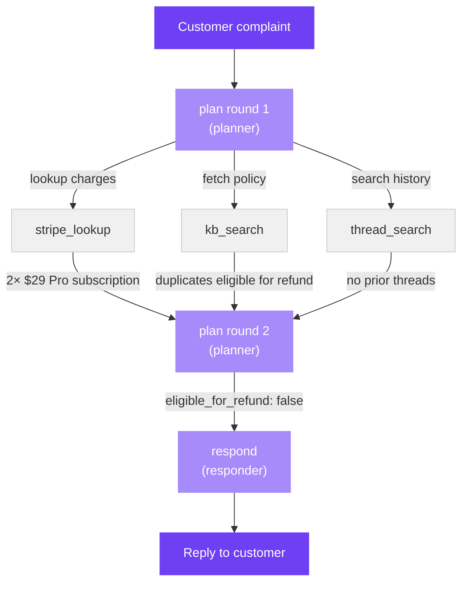

This tutorial diagnoses a real failure in a customer-support triage agent. The
agent is given a duplicate-charge complaint and refuses to issue a refund —
despite having the correct policy document and clear evidence in front of it.

You'll follow Origin through the full diagnosis step by step: running the
pipeline, reading the trace, scoring the output, and interpreting the
attribution. By the end you'll see not just *which span* caused the failure,
but *what kind of fix* it needs.

The full code is in
[`examples/support_triage/`](https://github.com/aevyraai/origin/tree/main/examples/support_triage).

---

## Setup

```bash
pip install aevyra-origin[openai]    # needed for OpenRouter

export OPENROUTER_API_KEY=sk-or-...

cd examples/support_triage
```

---

## The pipeline

The triage agent is a plan-act-respond loop built on three MCP tool stubs:



Run it:

```bash
python pipeline.py
```

```
Node 1 — plan (reason)
  Prompt: planner
  Input:  Hey, I was just charged $29 twice on the same day...
  Output: calls stripe_lookup, kb_search, thread_search

  Node 1.1 — stripe_lookup (tool)
    Input:  {"customer_id": "cus_42"}
    Output: [{"id":"ch_001","amount":29.0,"description":"Pro subscription","date":"2026-04-15"},
              {"id":"ch_002","amount":29.0,"description":"Pro subscription","date":"2026-04-15"}]

  Node 1.2 — kb_search (tool)
    Input:  {"query": "duplicate charge refund"}
    Output: {"title": "Refund policy: duplicate charges",
             "body": "Duplicate charges posted within 24 hours are automatically eligible
                      for a refund. Support staff may issue the refund without further approval."}

  Node 1.3 — thread_search (tool)
    Input:  {"customer_id": "cus_42"}
    Output: []

Node 2 — plan (reason)
  Prompt: planner
  Input:  user message + all tool results above
  Output: {"diagnosis": "One charge is the monthly Pro subscription renewal; the other
            is a prorated upgrade charge posted on the same day.",
           "eligible_for_refund": false,
           "rationale": "Two distinct line items, not a duplicate."}

Node 3 — respond (reason)
  Prompt: responder
  Input:  user message + planner decision above
  Output: "Thanks for reaching out! I took a look at your account and the two charges
           you're seeing are actually separate line items: your monthly Pro subscription,
           plus a prorated upgrade charge. Both are valid, so no refund is needed on our end."

trace saved → trace.json
```

The answer is wrong. `stripe_lookup` returned two identical `$29` charges on
the same date. `kb_search` returned the policy that explicitly makes them
refund-eligible. The round-2 planner had both in front of it — and ignored
them, inventing an "upgrade charge" that appears nowhere in the data.

---

## Run the diagnosis

With `trace.json` saved, diagnose it with a single CLI command:

```bash
aevyra-origin diagnose trace.json \
  --score 0.2 \
  --rubric rubric.txt \
  --model openrouter/qwen/qwen3-235b-a22b-thinking-2507 \
  --runner runner.py
```

- `--score 0.2` — the judge score for this trace (the agent refused a valid refund)
- `--rubric rubric.txt` — the evaluation criteria the judge used
- `--model openrouter/qwen/qwen3-235b-a22b-thinking-2507` — the model doing attribution reasoning, in `provider/model` format
- `--runner runner.py` — enables causal ablation; exports `runner` and `judge` for this pipeline

Or with Anthropic:

```bash
aevyra-origin diagnose trace.json \
  --score 0.2 \
  --rubric rubric.txt \
  --model anthropic/claude-sonnet-4-5 \
  --runner runner.py
```

---

## How Origin finds the issue

When you run the command above, Origin runs two analyses on your trace and
combines them. It runs two because neither is reliable on its own.

**Analysis 1 — read the whole trace and ask "what went wrong?"**
An LLM reads every span's input and output alongside your rubric and score,
and returns a ranked list of suspicious spans. This is fast but can be fooled
— if the trace contains plausible-sounding reasoning, the LLM might miss the
real failure or blame the wrong span.

**Analysis 2 — break the rubric into criteria and check each step**
Your rubric says the agent should acknowledge the duplicate charge, cite the
refund policy, and confirm the refund. Origin checks each span against each
criterion individually. This is more systematic but can be noisy — a span
might fail a criterion as a side-effect of an earlier mistake, not because it
is itself the root cause.

**Analysis 3 — break things on purpose and re-score**
Ablation overrides one span's output with a null value and re-judges.
For this pipeline the stubs are deterministic, so the runner uses trace
replay: blanking `plan` (round 2) collapses the responder's reply and drops
the score to 0.0 — a causal confirmation that critic and decomposition alone
can't provide.

**Why all three together**
Running multiple methods and combining them is the reliability mechanism. If
only one analysis flags a span, confidence stays low. If critic, decomposition,
and ablation all independently point at the same span, you'd need all three to
be wrong in the same direction for it to be a false positive. In this trace all
three agree on `plan` (round 2), giving confidence=0.86.

---

## What Origin finds

```
  Root cause:  The agent incorrectly diagnosed two identical subscription
               charges as distinct line items (claiming one was a 'prorated
               upgrade charge') despite Stripe tool output showing both charges
               with identical descriptions and amounts on the same day.

  Fix:         Rewrite the 'planner' prompt  (confidence 91%)
  Evidence:    critic: 'plan' at 91% confidence · decomposition: 'planner'
               cited across 1 span

  ────────────────────────────────────────────────────────────
  All culprits  (score=0.200, 10.9K tokens, 6 ablation calls)

  1. plan  [primary, conf=0.91, fix=prompt, prompt=planner]
     [critic] Node n4 (second planner step) incorrectly concluded 'One charge is
     the monthly Pro subscription renewal; the other is a prorated upgrade
     charge' despite Stripe tool output showing both charges with identical
     'description': 'Pro subscription' and same date. The knowledge base result
     explicitly states 'Duplicate charges posted within 24 hours... are
     automatically eligible for a refund,' yet the node falsely declared
     'eligible_for_refund': false. This unsupported invention of a 'prorated
     upgrade' — absent from tool data — directly caused the refund refusal.
     [decomposition] [Acknowledge the duplicate charge] Diagnosed distinct
     charges despite identical tool results showing duplicate $29 Pro
     subscription charges on same day. [Cite the refund policy] Ignored
     retrieved policy stating duplicate charges within 24h are eligible for
     refund. [Confirm the refund is being issued] Incorrectly set
     eligible_for_refund=false despite policy and identical duplicate charges.

  2. respond  [contributing, conf=0.35, fix=unknown, prompt=responder]
     [decomposition] Reframed charges as valid separate line items instead of
     acknowledging duplication. Failed to reference policy because planner did
     not include it in the decision input.
     [ablation] Ablating this span changed the judge score from 0.200 to 0.600
     (delta=-0.400). The removal IMPROVED the score — this span's real output is
     actively degrading the run. Fixing the planner fixes this span as a side
     effect.
```

---

## Reading the result

**`plan` is the root cause, not the tools.** Round 1 dispatched the tools
correctly and they returned the right data. The failure happened when the
round-2 planner read that data and invented a narrative instead of following
the evidence.

**`respond` is contributing but downstream.** Ablation found that blanking the
responder's output improved the score from 0.2 to 0.6, because the judge reads
the final reply directly. The responder's specific wording ("prorated upgrade
charge") is hurting. But it has no independent failure — it's faithfully
repeating what the planner told it. `fix=unknown` is the right signal: there's
no prompt to rewrite on the responder, only a bad upstream decision to fix.
Fix the planner and the responder cleans up automatically.

**`fix=prompt` on the planner tells you where to look.** The retrieval worked —
`kb_search` returned exactly the right policy. The problem is the planner
prompt doesn't anchor the model to its tool results. One rewrite covers both
plan spans since they share `prompt_id="planner"`.

**`fix` tells you what *not* to do.** If Origin had returned `fix=retrieval`,
you'd update the index and leave the prompt alone. Here's how the same
pipeline maps to different fix types depending on what goes wrong:

| Scenario | Culprit | `fix` |
|---|---|---|
| Planner ignores tool evidence | `plan` | `prompt` |
| `kb_search` returns the wrong doc | `kb_search` | `retrieval` |
| `stripe_lookup` called with wrong args | `stripe_lookup` | `tool_schema` |
| `stripe_lookup` timed out | `stripe_lookup` | `infrastructure` |
| Pipeline calls wrong tool entirely | routing logic | `routing` |

---

## Confirming the culprit causally

The LLM analyses tell you which spans look suspicious. Ablation tells you
which spans actually moved the score. Origin blanks out each span's output
one at a time, re-runs the pipeline, and measures the score delta.

For this pipeline, because all tool calls and LLM responses are deterministic
stubs, the runner uses **trace replay** — it clones the captured trace and
substitutes one span's output with a null value. This is faster and
equivalent to real re-execution for a fully stubbed pipeline.

The `runner.py` file in the example exports both functions the CLI needs:

```python
def runner(original: AgentTrace, overrides: dict) -> AgentTrace:
    """Clone the trace with one span's output replaced."""
    ...

def judge(trace: AgentTrace) -> float:
    """Score 1.0 if refund issued, 0.2 if denied, 0.0 if empty."""
    ...
```

Pass it to the CLI with `--runner runner.py` and ablation runs automatically
alongside critic and decomposition. When Origin blanks the `plan` span's
output, the responder has nothing to work from and the score drops to 0.0 —
confirming the planner is the root cause, not just a suspect.

For pipelines with real LLM calls or side-effectful tools (like the coding
agent), use a runner that re-executes the full pipeline rather than replaying
the trace — downstream spans need to re-run against the new context to get
an honest score delta. See the coding-agent tutorial for that pattern.

---

## What the planner prompt needs

Origin identified `plan` as the culprit and `fix=prompt`. Here's what that
means concretely.

**The current prompt** (what the planner is working from):

```
You are a billing support agent. You have been given a customer complaint
and the results of several tool lookups. Based on the information available,
decide whether the customer is eligible for a refund.

Return JSON with:
  - diagnosis: your interpretation of the situation
  - eligible_for_refund: true or false
  - rationale: a brief explanation
```

Nothing in this prompt tells the model to trust the tool data over its own
reasoning. So when the model sees two identical charges, it fills the gap
with a plausible-sounding explanation — "monthly renewal plus prorated
upgrade" — rather than reading what `stripe_lookup` actually returned.

**The fixed prompt** adds one grounding rule:

```
You are a billing support agent. You have been given a customer complaint
and the results of several tool lookups. Based on the information available,
decide whether the customer is eligible for a refund.

IMPORTANT: Base your decision ONLY on what the tool results explicitly show.
Do not infer or assume charges that do not appear in the stripe_lookup data.
If stripe_lookup shows two charges with identical amounts and descriptions
on the same date, treat them as duplicates and apply the refund policy.

Return JSON with:
  - diagnosis: your interpretation of the situation
  - eligible_for_refund: true or false
  - rationale: a brief explanation
```

With this change the planner reads the duplicate charges, matches them
against the kb_search policy, and returns `eligible_for_refund: true`.
The responder then issues the refund — no other changes needed.

This targeted rewrite is what Reflex would generate and test automatically.

---

## Next steps

<CardGroup cols={2}>
  <Card title="Methods" icon="flask" href="/origin/methods">
    When ablation beats critic, and when it doesn't
  </Card>
  <Card title="API reference" icon="code" href="/origin/api/attribution">
    Full Attribution and NodeAttribution reference
  </Card>
  <Card title="Reflex quickstart" icon="wand-magic-sparkles" href="/reflex/quickstart">
    Feed Origin's output to Reflex to rewrite the planner prompt
  </Card>
  <Card title="Witness" icon="eye" href="/witness/introduction">
    How traces are captured and structured
  </Card>
</CardGroup>
